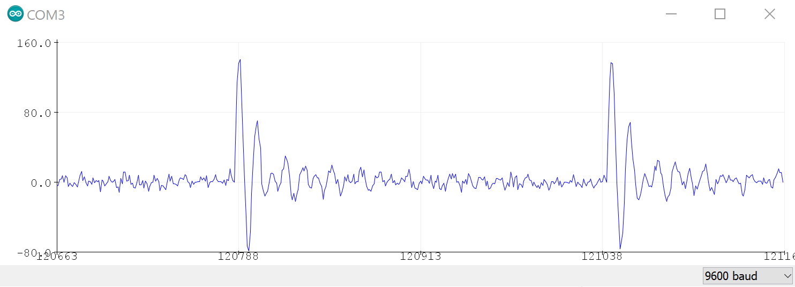
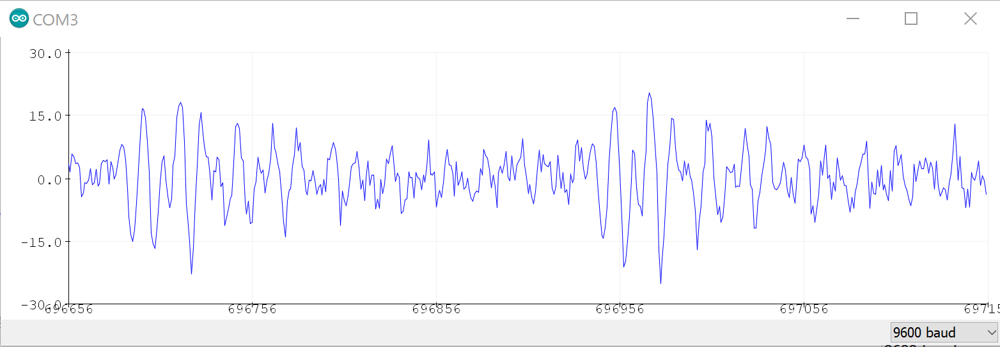

## Brainwave Generator

A project I worked on required reading brainwaves from the head through electrodes. We were a team of six including electrical and software engineers. The hardware part of the team was responsible of reading the signal filtering it, amplifying it, sampling it and sending it to the software side for further analysis. As head of the hardware side and as the software team needed to test their side independently, I decided to design a software based brainwave generator, to give it to the software side to implement their initial testing based on the theoretical or ideal signal obtained from the brain. In this post, I will explain how that is implemented. But to understand that better, I will start by explaining the biology of a brainwave, the basic constituents that would make a brainwave and its signal analysis, leading to the design process of the software, and finally the software implementation. 

### Biology and physics of brainwaves:
The brain communicates with the body using the nervous system. The nervous system carries electrical signals. The brain manipulates voltage fluctuations to induce electric current, traveling through the body with the encoded information to the intended destination. Physically, these electric currents are the same as those inside any electrical conductor, and thus the same laws of physics apply. Namely Faraday's law: first that a changing electric current will cause a changing electric field which will in turn induce a changing magnetic field. So, if the brain is sending electric currents, then these currents are generating magnetic fields. Then, if we can observe the magnetic field, or what we also call brainwave, how would we make sense of it? In theory, if different states of the brain would result in unique patterns in the electric signals, then observing these patterns would be a good indication for the corresponding brain state. Obviously, the brain is very complex with so many functionalities, many of which are not well understood, so it is much easier to focus on something specific rather than try to make sense of the whole brain. 
Luckily, for our project purpose, there is already a body of research showing a correlation between the level of sleepiness or alertness of a person and the dominant frequency of the brainwaves. 

### How to interpret brainwaves?
For the outside observer, a brainwave is only a change in magnetic field, which if presented to an electric conductor would induce voltage in the conductor. But what do these mean and how do we start to interpret them? If we had access to individual neurons, then we can observe their behavior and maybe using super computers, or possibly quantum computers, to reach an understanding of their collective behavior. But, from outside the brain, with billions of neurons firing together, variation of the signal in time may not give the best collective information. However, similar neuron signals, or their collective firing would result in similar frequencies. And the research shows, depending on which frequency is dominant, we can know the dominant state of the brain.

Looking at the table below which mimics imperical data, we see the brainwave for each frequency band and its corresponding state. For example, below 4Hz is a deep sleep state. Then the raw signal at the top of the table represents a combination of these bands with one band being dominant depending on the state of the brain.

 &nbsp; &nbsp; &nbsp; &nbsp; &nbsp;    
 &nbsp; &nbsp; &nbsp; &nbsp; &nbsp; EEG frequency bands. Image source: Conorrus Somanno

Another source is also from [neurosky](http://support.neurosky.com/kb/science/eeg-band-frequencies), which supports the same data but also adds the gamma bands that is above 35Hz to 50Hz.

So how do we know which frequency is dominant?
To know which frequency is dominant, it means we must distinguish between the different frequencies. That is a topic for DSP (digital signal processing) and Fourier analysis.

### Fourier analysis:
Fourier analysis is a set of tools introduced by the mathematician and physicist Joseph Fourier. One tool is the Fourier series which essentially says that any signal or mathematical function can be represented by a sum of periodic functions. Another tool is the Fourier transform which can transform the signal from its time representation to its frequency components and vice versa, and a practical version of it that is used in DSP is the FFT (Fast Fourier Transform). So, if we have a signal ready, and we want to examine its frequency components then, we use the FFT. For our project, that is what we do; we obtain the signal from the brain, perform some analog processing then start the digital processing by performing the FFT. But if we do not have the signal ready, or if we want to model a signal from scratch, and we want to make sure that it does have the necessary frequency components so that the FFT yields the correct results, then we need to use Fourier series analysis.

### Generating brainwaves:
For this project, we are interested in a signal ranging from 0Hz to about 50Hz. So, what I can start with is adding periodic signals, such as a sinusoidal, ranging from 0Hz to 50Hz. Additionally, to show a brain state, the amplitude of the sinusoidals of the corresponding frequency band must be dominant.

* **Design:** The code is to simulate a brainwave mimicing either one of the following brain states: excited, relaxed, drowsy, asleep, or deep sleep. Based on that, I am creating a class *Brainwaves* which takes one of the brain states as a parameter to determine the desired state like shown:  
`Brainwaves instance (Drowsy);`  
and for running the simulation, simply: `instance.simulation();`  
When an instance is instantiated with a parameter, for example *Drowsy* then, the dominant frequency must be *Theta* but the other bands must not completely disappear as that would not be realistic. Therefore, the class *Brainwaves* should have all five frequency bands *(Gamma, Beta, Alpha, Theta, Delta)* and the dominant frequency band is picked based on the passed parameter. This design asks for a second class, *Frequency_band*, that takes the desired frequency band and the average magnitude of that band as parameters. Also, the five brain states share a common category but they are constant (at least in this case as we are not using machine learning to associate the different bands with the five states) so a state does not warrant a class and therefore I will only use an enum to group the states.  

* **Calculations:** To run the simulation and have something useful, we need to run the simulation for at least a full fundamental cycle/period. For, sin(2π f t), where for example f=1, a fundamental cycle is on the period [0,1], and for f=2, the fundamental cycle is [0, 0.5]. For an addition of two or more signals with different frequencies, the fundamental period is the least common multiple of all the periods = LCM(T1, T2, … Tn). Then for frequencies going from 0 to 50Hz, sin(2π t)+ sin(2π 2 t)+ …… sin(2π 50 t), the fundamental period T = LCM(1/1,1/2,1/3 …, 1/50) = 1 second, or fundamental frequency F= GCD(1,2,…60)= 1Hz. Accounting for the signal resolution, the number of samples = resolution*F.  

* **Implementation:** to implement a brainwave generator, by now we know that we must account for two things: 1. underlying frequencies composing the signal 2. The magnitudes the periodic signals of these frequencies. For example, a person who is said to be drowsy should have the frequencies within the alpha band (~8-12Hz) as dominant frequencies. To account for the frequencies, we can add a periodic signal at each particular frequency according to Fourier analysis. I will use sin() as my periodic function of choice. To account for the magnitude, one option is to simply set all the frequencies within the dominant band at fixed value that is higher than another fixed value set for all the magnitudes of the other frequencies. The following is the result for the first implementation which is graphed on an Arduino plotter:  
&nbsp;  
This is statically repeating. To fix that I am adding a random variance within a certain range, where for example, the dominant frequencies can randomly vary with +/- 5 maximum, and the secondary frequencies can randomly vary with +/- 1 maximum. 
This results in something like this:  
&nbsp;   
This clearly shows the variance but still has some underlying repeating pattern. The underlying repeating element is needed for Fourier analysis, but we can disguise it more to realistically resemble a brainwave. The distinct part is the big spike which lies in the beginning of the cycle. To get rid of that, I multiply by a ramp function saturating at the end of the spike. The following is the result:  
&nbsp; 
To get even a better result, instead of setting the secondary frequencies to a unified value I set them to a varying value based on the proximity to the dominant band. That can be done using a normal/Gaussian distribution where the mean/center of the distribution is a frequency within the dominant band. But, that might be done later as this is currently functional.

This is the current final result. It shows a signal that resembles a brainwave, similar to the EEG signal in the first graph.A side use case is that now we have a function that can continously displays a simulation of a brainwave, but the main functionality of this is that it can be fed to an FFT function and the FFT would indicate the dominant frequencies based on the desired state of the brain. Indeed, this was tested seperately by a colleague by feeding it to an FFT function and the expected results were produced. 
**Hope you find this useful.**